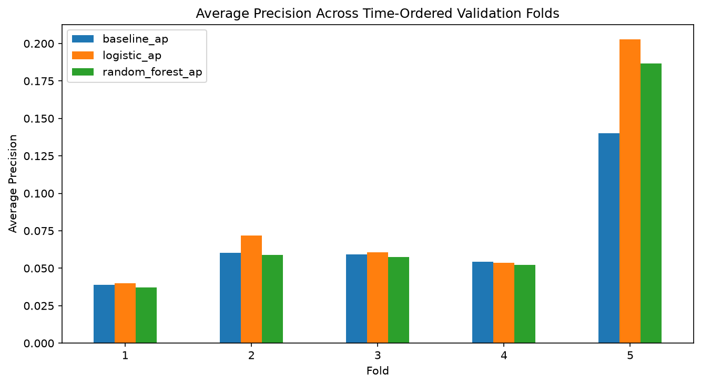
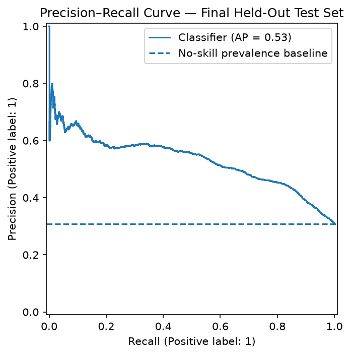
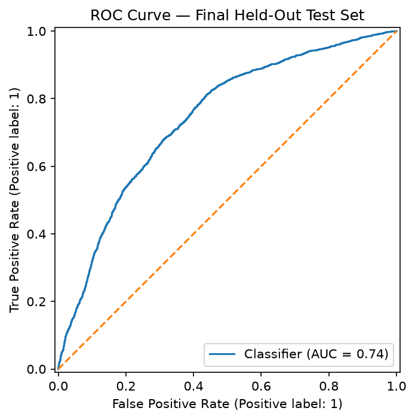
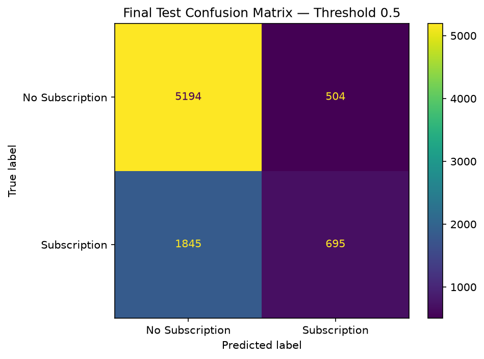
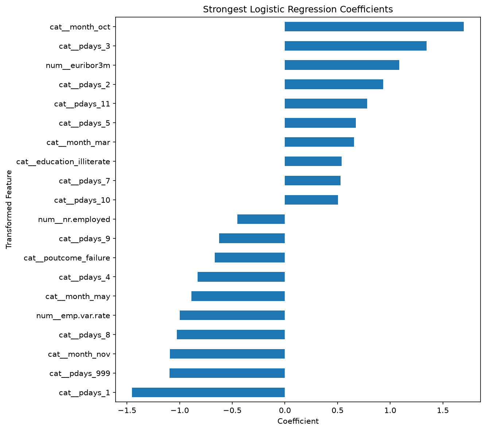

# Bank Term Deposit Subscription Prediction

An end-to-end machine learning project for predicting whether a bank customer will subscribe to a term deposit.

The project focuses not only on predictive performance, but also on leakage prevention, temporal validation, class imbalance, failure analysis, model interpretation, and responsible use.

## Project Overview

The goal is to predict the binary target:

- `yes` — the customer subscribed to a term deposit
- `no` — the customer did not subscribe

The intended prediction point is immediately before a specific marketing contact, after the planned contact context is known but before the outcome of that contact is observed.

The model is intended as a decision-support or customer-ranking tool rather than an automated eligibility or approval system.

## Dataset

The project uses the Bank Marketing dataset containing:

- 41,188 observations
- 20 input variables
- 1 binary target variable: `y`

The dataset is chronologically ordered, so the final 20% of observations were reserved as an out-of-time test set.

| Split | Rows |
|---|---:|
| Development | 32,950 |
| Final held-out test | 8,238 |

The development positive-class rate was approximately **6.37%**, while the final test positive-class rate increased to approximately **30.83%**, revealing substantial temporal distribution shift.

## Leakage Prevention

The original dataset contains the feature:

`duration`

This represents the duration of the current marketing call.

Because call duration is only known after the call has occurred, using it for a prediction made before the contact outcome would introduce target-time leakage.

Therefore:

**`duration` was excluded from all modeling pipelines.**

The final model uses 19 input features.

## Validation Strategy

A random train/test split was intentionally avoided because the observations are time ordered.

The evaluation strategy was:

1. First 80% of observations → development data
2. Last 20% → untouched out-of-time test data
3. 5-fold expanding-window `TimeSeriesSplit` inside the development set
4. Model selection based primarily on cross-validated Average Precision
5. Final held-out test opened only after model, preprocessing, hyperparameters, and threshold decisions were fixed

## Primary Metric

The positive class was strongly imbalanced during development, so accuracy was not used as the primary model-selection metric.

The primary metric was:

**Average Precision (AP)**

Additional diagnostics included:

- ROC-AUC
- Precision
- Recall
- F1-score
- Accuracy
- Confusion matrix
- Precision–Recall curve
- ROC curve

## Models Evaluated

Three main modeling stages were compared:

- Dummy baseline
- Logistic Regression
- Random Forest

The default Random Forest achieved extremely high training Average Precision but generalized poorly to later validation periods, showing strong overfitting.

Logistic Regression was more consistent and outperformed Random Forest across the time-ordered validation folds.

The Logistic Regression model was therefore selected for tuning.

### Selected Hyperparameters

```text
C = 10.0
class_weight = None
```

Hyperparameter tuning only slightly improved development Average Precision, suggesting that performance limitations were driven more by available signal and temporal changes than by regularization strength.

## Final Held-Out Results

The selected model was evaluated once on the final out-of-time test set.

| Metric | Result |
|---|---:|
| Positive prevalence | 0.3083 |
| Average Precision | **0.5299** |
| No-skill AP baseline | 0.3083 |
| AP lift over baseline | **1.72×** |
| ROC-AUC | **0.7407** |
| Precision @ 0.5 | 0.5796 |
| Recall @ 0.5 | 0.2736 |
| F1 @ 0.5 | 0.3718 |
| Accuracy @ 0.5 | 0.7149 |

### Confusion Matrix at Threshold 0.5

| | Predicted No | Predicted Yes |
|---|---:|---:|
| Actual No | 5,194 | 504 |
| Actual Yes | 1,845 | 695 |

The conventional 0.5 threshold was conservative: it achieved approximately 58% precision but identified only around 27% of actual subscribers.

No custom operating threshold was selected because threshold behavior was unstable across validation periods and no business-specific cost function or campaign-capacity constraint was provided.

## Evaluation Evidence

### Model Comparison



### Precision–Recall Curve



### ROC Curve



### Confusion Matrix



## Failure Analysis

False negatives were the dominant classification error at the reference threshold of 0.5.

The model missed approximately **72.6% of actual subscribers**.

Failure analysis also showed that performance varied substantially across:

- previous campaign outcome
- campaign month
- contact method
- occupational groups

For example, subscribers with previous successful campaign outcomes were identified substantially more often than subscribers with failed or nonexistent previous campaign outcomes.

Strong month-level differences were also observed, reinforcing evidence of temporal instability.

These patterns are descriptive and should not be interpreted as causal relationships.

## Model Interpretation

The fitted Logistic Regression coefficients indicated strong contributions from:

- economic indicators
- campaign timing
- previous campaign information

Several economic variables, including `euribor3m`, `emp.var.rate`, and `nr.employed`, were highly correlated, so their individual coefficients should not be interpreted independently.

Some high-magnitude categorical coefficients were also associated with low-support categories and should therefore be interpreted cautiously.



Model coefficients represent predictive associations, not causal effects.

## Limitations

Important limitations include:

- substantial temporal distribution shift
- unstable threshold behavior across periods
- high false-negative rate at threshold 0.5
- dependence on time-sensitive economic and campaign signals
- correlated economic predictors
- low-support categorical levels
- historical and context-specific dataset
- no business-defined operating threshold
- probability calibration not separately validated

The model should therefore be considered a **decision-support prototype**, not a production-ready automated targeting system.

Before operational use, the system would require newer validation data, drift monitoring, calibration assessment, business-specific threshold design, and ongoing performance monitoring.

## Project Structure

```text
bank-marketing-ml/
│
├── data/
│   ├── bank-additional-full.csv
│   └── README.md
│
├── models/
│   ├── bank_subscription_pipeline.joblib
│   └── model_metadata.json
│
├── notebooks/
│   └── 01_bank_marketing_analysis.ipynb
│
├── reports/
│   ├── final_metrics.json
│   └── figures/
│       ├── model_comparison_ap.png
│       ├── final_confusion_matrix.png
│       ├── final_precision_recall_curve.png
│       ├── final_roc_curve.png
│       └── logistic_coefficients.png
│
├── src/
│   └── train.py
│
├── requirements.txt
├── .gitignore
└── README.md
```

## Setup

Clone the repository and move into the project directory:

```bash
git clone https://github.com/NourhanFarag bank-marketing-subscription-prediction.git
cd bank-marketing-subscription-prediction
```

Create a virtual environment:

### Windows

```powershell
python -m venv .venv
.venv\Scripts\activate
```

### macOS / Linux

```bash
python -m venv .venv
source .venv/bin/activate
```

Install dependencies:

```bash
pip install -r requirements.txt
```

## Run the Complete Training Pipeline

From the project root:

```bash
python src/train.py
```

The script will:

1. Load the dataset
2. Validate the expected schema
3. Create the chronological development/test split
4. Build the preprocessing pipeline
5. Tune Logistic Regression using time-ordered cross-validation
6. Evaluate the selected model on the final held-out period
7. Save the fitted pipeline
8. Save model metadata
9. Save final metrics

Generated artifacts:

```text
models/bank_subscription_pipeline.joblib
models/model_metadata.json
reports/final_metrics.json
```

## Reproduce the Analysis

For the complete reasoning process, exploratory analysis, leakage audit, model comparison, threshold investigation, failure analysis, interpretation, and limitations, open:

```text
notebooks/01_bank_marketing_analysis.ipynb
```

The notebook has been verified with a clean **Restart + Run All** execution.

## Saved Model

The serialized artifact contains the complete fitted pipeline:

```text
Raw 19 input features
        ↓
Numerical StandardScaler
        +
Categorical OneHotEncoder
        ↓
Logistic Regression
```

The fitted pipeline can be loaded with:

```python
import joblib

model = joblib.load(
    "models/bank_subscription_pipeline.joblib"
)
```

Only load serialized model files from trusted sources.

## Key Takeaway

The most important lesson from this project was that reliable machine learning evaluation requires more than reporting a high score.

The final result depended heavily on:

- defining the prediction point correctly
- removing target-time leakage
- respecting temporal ordering
- choosing metrics appropriate for class imbalance
- comparing against a baseline
- identifying overfitting
- investigating threshold instability
- analyzing failure cases
- and explicitly documenting model limitations

The final Logistic Regression provides useful ranking ability, but the observed temporal shift and unstable decision behavior show why predictive performance must be interpreted in the context in which the model will actually be used.